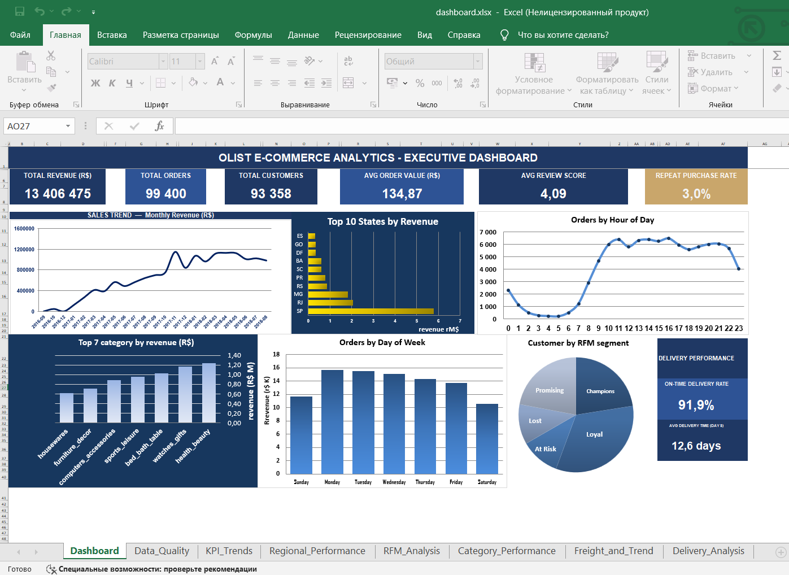
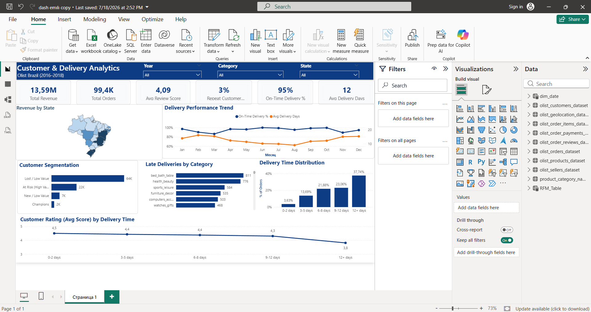

# Olist Marketplace Analytics

Business Intelligence project based on the Brazilian Olist e-commerce dataset. The project demonstrates the complete analytics workflow from SQL data analysis to interactive dashboards in Excel and Power BI.

---

## Project Overview

This project analyzes customer behavior, sales performance, delivery efficiency, and customer satisfaction using SQL, Excel, and Power BI.

The analysis covers:

- Business KPIs
- Customer segmentation (RFM)
- Sales and product performance
- Delivery performance
- Customer reviews
- Regional analysis

---

## Tools & Technologies

- SQL (SQLite)
- Excel
- Power BI
- Git & GitHub

---

## Dataset

Brazilian E-commerce Public Dataset by Olist

https://www.kaggle.com/datasets/olistbr/brazilian-ecommerce

---

## Project Structure

```
olist-marketplace-analytics/

├── data/
│   └── olist.sqlite
│
├── sql/
│   ├── 01_data_quality.sql
│   ├── 02_business_kpis.sql
│   ├── 03_customer_segmentation.sql
│   ├── 04_sales_analysis.sql
│   ├── 05_delivery_analysis.sql
│   └── 06_review_analysis.sql
│
├── excel/
│   └── dashboard.xlsx
│
├── powerbi/
│   └── dashboard.pbix
│
├── screenshots/
│   ├── excel_dashboard.png
│   └── powerbi_dashboard.png
│
├── README.md
└── LICENSE
```

---

# SQL Analysis

The project contains six analytical SQL modules:

- Data Quality Validation
- Executive Business KPIs
- Customer Segmentation (RFM)
- Sales Analysis
- Delivery Analysis
- Review Analysis

---

# Excel Dashboard

Executive dashboard built in Excel.

Features:

- Revenue KPIs
- Monthly Sales Trend
- Revenue by State
- Orders by Hour
- Orders by Weekday
- Top Product Categories
- Customer RFM Segmentation
- Delivery Performance



---

# Power BI Dashboard

Interactive dashboard with slicers and drill-down analysis.

Features:

- Revenue Overview
- Delivery Performance
- Customer Segmentation
- Delivery Time Distribution
- Revenue by State
- Customer Rating vs Delivery Time



---

# Key Business Insights

- Nearly 96,500 completed orders were analyzed.
- Total revenue exceeded R$19.7 million.
- Most customers purchased only once.
- Delivery delays negatively impacted review scores.
- São Paulo generated the highest revenue.
- Health Beauty and Watches categories were among the top revenue contributors.

---

# Author

Emiliia Ismayilova

GitHub:
https://github.com/emiliiasmailova3
