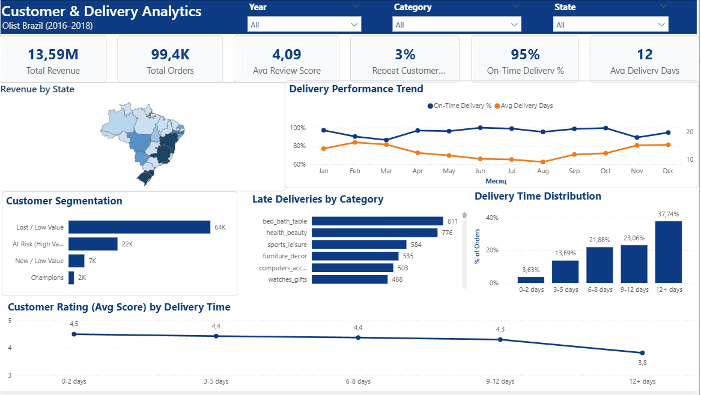
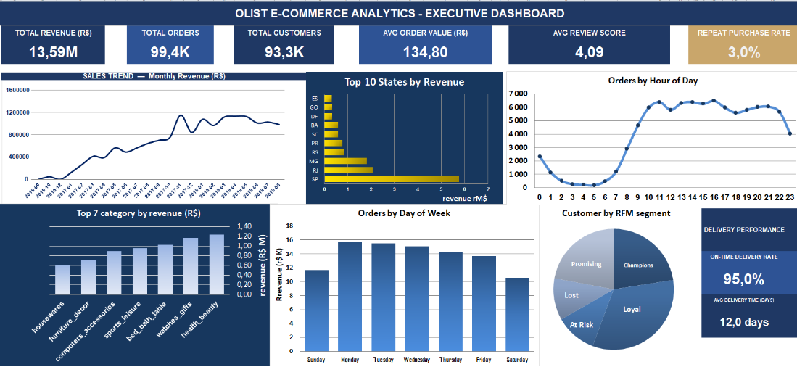

# Olist Marketplace Analytics

End-to-end Business Intelligence project on the Brazilian Olist e-commerce dataset (~99K orders, 2016–2018): data quality checks and analysis in **SQL**, an executive dashboard in **Excel**, and an interactive dashboard in **Power BI**.



---

## Business Questions

- What are the core KPIs — orders, customers, revenue, average order value?
- Who are the customers, and how many come back? (RFM segmentation)
- Which categories, price bands and sellers drive sales?
- How fast and how reliably are orders delivered, by state?
- How does delivery experience affect review scores?

## Key Insights

- **Retention is the main weakness:** about 97% of customers ordered only once.
- **Late delivery hurts ratings:** the average review score falls from ~4.5 for orders delivered within 2 days to ~3.8 for orders taking 12+ days.
- **Revenue is concentrated in the Southeast:** São Paulo is the largest state by revenue.
- **Top categories:** health & beauty and watches & gifts are among the largest revenue contributors.

## Tools

| Stage | Tool |
|---|---|
| Data quality & analysis | SQL (SQLite): CTEs, window functions (`NTILE`, `RANK`, `LAG`, running totals) |
| Executive dashboard | Excel |
| Interactive dashboard | Power BI (slicers, map, drill-down) |

## SQL Analysis

| File | What it covers |
|---|---|
| [`01_data_quality.sql`](sql/01_data_quality.sql) | Row counts, NULL checks, duplicates, referential integrity, PASS/FAIL summary |
| [`02_business_kpis.sql`](sql/02_business_kpis.sql) | Executive KPIs, monthly trend with MoM growth, quarterly results, order timing, category and state revenue |
| [`03_customer_segmentation.sql`](sql/03_customer_segmentation.sql) | One-time vs repeat buyers, RFM segmentation, simplified CLV, top customers |
| [`04_sales_analysis.sql`](sql/04_sales_analysis.sql) | Category Pareto, year-over-year category growth, basket size, price bands, payment methods, seller concentration |
| [`05_delivery_analysis.sql`](sql/05_delivery_analysis.sql) | Delivery time, on-time vs late, performance by state, delivery speed vs review score |
| [`06_review_analysis.sql`](sql/06_review_analysis.sql) | Review distribution, satisfaction by category and state |

Completed orders are defined as `order_status = 'delivered'`. Revenue is calculated per order before joining other tables, to avoid double counting.

## Dashboards

**Power BI**: revenue by state (map), delivery performance trend, customer segments, late deliveries by category, delivery time distribution, rating vs delivery time. File: [`powerBI/`](powerBI/)

**Excel**: revenue KPIs, monthly sales trend, revenue by state, orders by hour and weekday, top categories, RFM segments, delivery performance. File: [`excel/dashboard.xlsx`](excel/dashboard.xlsx)



## How to Reproduce

1. Download the [Brazilian E-commerce Public Dataset by Olist](https://www.kaggle.com/datasets/olistbr/brazilian-ecommerce) from Kaggle.
2. Load the CSV files into a SQLite database `data/olist.sqlite` with these table names: `orders`, `order_items`, `order_payments`, `order_reviews`, `customers`, `sellers`, `products`, `category_translation`.
3. Run the scripts in `sql/` in order (e.g. in DB Browser for SQLite or DBeaver).
4. Open the `.pbix` file in Power BI Desktop or the `.xlsx` file in Excel.

The database itself is not included in the repository because of its size.

## Project Structure

```
olist-marketplace-analytics/
├── sql/
│   ├── 01_data_quality.sql
│   ├── 02_business_kpis.sql
│   ├── 03_customer_segmentation.sql
│   ├── 04_sales_analysis.sql
│   ├── 05_delivery_analysis.sql
│   └── 06_review_analysis.sql
├── excel/
│   └── dashboard.xlsx
├── powerBI/
│   └── Power BI dashboard (.pbix)
├── screenshots/
│   ├── excel_dashboard.png
│   └── powerbi_dashboard.png
├── README.md
└── LICENSE
```

## Author

**Emiliya Ismailova** — Junior Data Scientist
[LinkedIn](https://linkedin.com/in/emiliya-ismailova) · [GitHub](https://github.com/emiliaismailova3)
